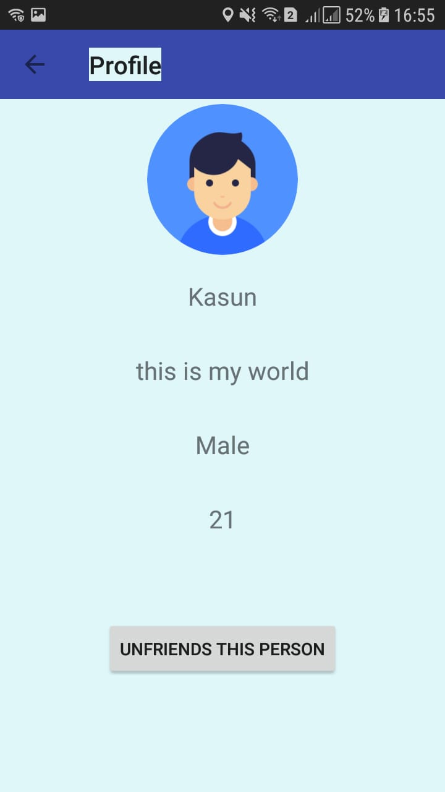

# COMO Android Application (Chatting applicatoin with searching nearby users)

## Introduction
Basically, this is a chatting application. It is used for the chat with other people who register with this application. It has a special feature. It can search people who nearby us. Chat app is like a social media application. Every user has a unique friends list. It can add to the user’s preference. Whether people our friends or not, we can search people who nearby us. Also, we can message them if he accepts the request. This is very important for emergency purpose. Such as some trouble occurs with traveling. It can get help from others. This application also has other social media option. Every user has their profile. Only can chat with one to one. It can share images. It can look our friends online or not. It uses push notification to inform friends' request and message. 

* In that application we can chat with them. Add other users as our friends, View their locations.
* Shaking mobile phone with opening application help to find near mobile application users(it is shedule withing 2km people) showing though application. It can request help from nearby people.
  
## Technologies 

* Android Studio
* Firebase Authentication
* Firebase Realtime database
* Firebase Storage
* Google Location API
* Accelerometer, Gyroscope, GPS. 
* Also shared preferences

### UML Diagram

### Screenshots
      

### Backend - Firebase (Authentication, Database, Storage)
  
